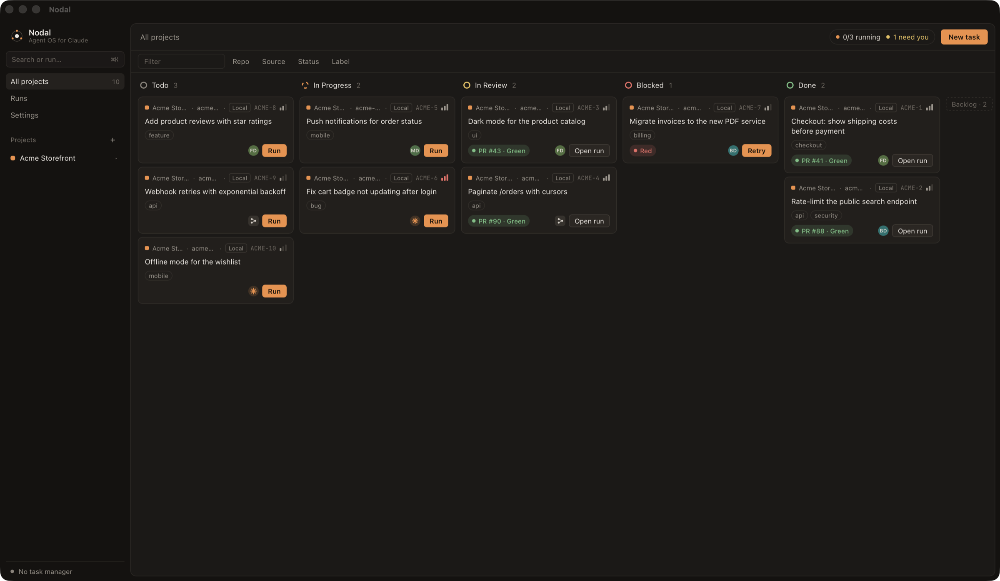

# Nodal

[](https://github.com/Mazp17/nodal-agentos/actions/workflows/ci.yml)
[](https://github.com/Mazp17/nodal-agentos/releases)
[](#install)
[](LICENSE.md)

**Agent OS for Claude.** Plan tasks on a board, hand them to Claude Code agents and follow every run across all your repos.

[Español](README.es.md)



> Early alpha, macOS only. Independent project, not affiliated with Anthropic.

## Install

1. Download the latest `.dmg` from [Releases](https://github.com/Mazp17/nodal-agentos/releases) (Apple Silicon and Intel) and drag Nodal to Applications.
2. Nodal is not notarized by Apple, so macOS blocks the first launch. Run once:

   ```bash
   xattr -dr com.apple.quarantine /Applications/Nodal.app
   ```

After that, Nodal updates itself: it checks for a new version on launch and once a day (and from Nodal → Check for Updates… or Settings → Updates), shows the release notes and installs it only if you choose Update. Updates don't need the `xattr` step again. Nodal 0.1.0 predates in-app updates, so from 0.1.0 download the next version by hand one last time.

You need [Claude Code](https://docs.claude.com/en/docs/claude-code) installed and logged in, and `git`. `gh` is optional, for tasks that open pull requests. Open `claude` once in each repo and accept the trust dialog before running tasks there.

## What it does

- **Board of tasks** grouped in projects, each project with one or more local repos. Plans in markdown, acceptance criteria, priority and labels.
- **Delegate** each task to one of your agents (`~/.claude/agents`, the repo's or a plugin), a workflow, or plain Claude.
- **Isolated by default**: every task gets its own git worktree and branch, so several run on the same repo at once.
- **Finish** with uncommitted changes, a commit, or a pull request.
- **Automatic review** against the acceptance criteria: pass goes to In Review, fail to Blocked with the findings.
- **One queue** with a global concurrency limit, and a live view of each run: phases, subagents, transcript, tokens and diff.
- **Linear, optional**: import issues, route them to repos and keep statuses in sync. More task managers are planned.

## How it works

Nodal drives the `claude` CLI you already have (`claude --bg`, `--agent`, `/<workflow>`) and reads progress from `claude agents --json` and the session files under `~/.claude/projects`. Those files are an undocumented internal format, so a Claude Code update can break the parsing.

Everything stays on your Mac: an SQLite database, worktrees under `~/.nodal`, API keys in the Keychain. No network server, no telemetry.

### Agents (MCP)

While Nodal is open, agents can list projects and tasks, create and update tasks and read run results through MCP. The app listens on a Unix socket in its data folder (readable only by you, no network port) and `nodal-mcp`, which ships inside the app, bridges it to stdio. Register it:

```bash
claude mcp add nodal -- /Applications/Nodal.app/Contents/MacOS/nodal-mcp
```

From source, build it with `cargo build --release --bin nodal-mcp` in `src-tauri` (after `pnpm build`) and register `src-tauri/target/release/nodal-mcp` instead.

Tools: `list_projects`, `list_tasks`, `get_task`, `create_task`, `update_task` and `get_run`. Runs are launched from the app. A debug build of `nodal-mcp` talks to a debug build of the app.

The [`nodal-tasks` skill](skills/nodal-tasks/SKILL.md) teaches agents when to create a task instead of doing the work, how to write its plan and acceptance criteria, how to pick the repo and the executor, and how to read a run's result. Install it with [skills](https://skills.sh):

```bash
npx skills add Mazp17/nodal-agentos --skill nodal-tasks
```

## Build from source

Needs Node.js 20+, pnpm 10 and stable Rust.

```bash
git clone https://github.com/Mazp17/nodal-agentos.git nodal
cd nodal
pnpm install
pnpm tauri dev
```

Built with [Tauri 2](https://tauri.app) (Rust + SQLite) and React 19 + TypeScript. See [CONTRIBUTING.md](CONTRIBUTING.md) to work on it and [RELEASING.md](RELEASING.md) for how versions ship.

## License

[MIT](LICENSE.md) © Nodal contributors
